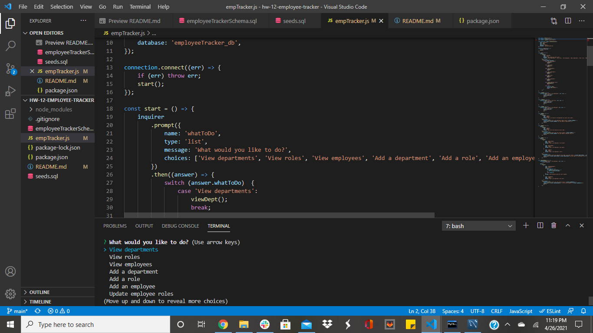

# Employee Tracker

## Description
This application manages a company's employees with node, inquirer, and MySQL. Using a command-line application, it is possible for a company to add or view departments, roles, employees, and update employee roles.

## Installation
In the code editor, select the folder to use and open the Integrated Terminal (or GitBash). From there run npm init -y, followed by npm i mysql, npm i inquirer, and npm i console.table. 

## License
This project is licensed under the MIT license. Click the link below for more info.

[MIT License](https://opensource.org/licenses/MIT)

## Usage
Click the link below to see a video of how the application works.

[Employee Tracker](url.com)

